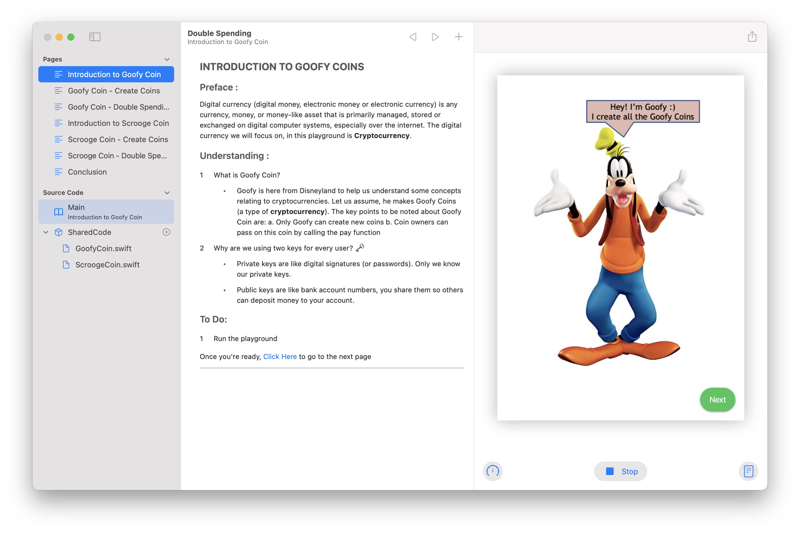
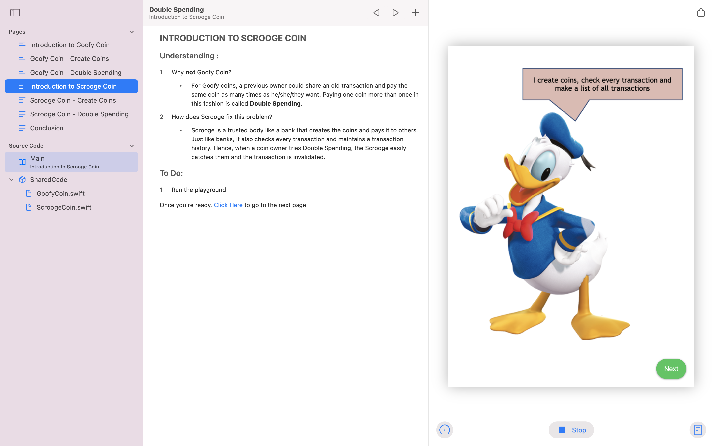

# Double Spending
 
 

## Introduction

It's been 38 years since David Chaum first introduced the idea of digital currency but even today, a lot of people find its working mysterious. The first cryptocurrency, Bitcoin was introduced in 2009 (just a little more than a decade ago). This year, a greater interest has been seen in cryptocurrencies due to their rising evaluation. Hence, this playground aims to teach about one major challenge all digital currencies face, i.e. the Double Spending Attack. We examine this using the concept of Goofy and Scrooge Coins. I had recently studied this concept as a part of my university curriculum and this concept was easy to grasp yet had a large impact on my understanding of cryptocurrencies. Hence, I built this playground to share my love for Disney, Cryptocurrencies and Coding.

## Steps to Run

1. Download the Swift Playgrounds App for macOS 11.2.3
2. Clone this repository
3. Open the playground using Swift Playgrounds

## About this Playground

This is an informative playground that tries to teach you about Double Spending Attack and the need for P2P networks in cryptocurrencies. Some screenshots from the playground:

### Goofy Coins

 
 

https://user-images.githubusercontent.com/48411560/120389237-c6301180-c349-11eb-861d-19a316602bc0.mov

### Scrooge Coins
 
  
 
https://user-images.githubusercontent.com/48411560/120389603-422a5980-c34a-11eb-8857-9076bb516a61.mov
 
 

https://user-images.githubusercontent.com/48411560/120389758-77cf4280-c34a-11eb-970f-99381be8d441.mov

 

## License

Checkout the license [here](https://github.com/garima94921/DoubleSpensing-WWDC21/blob/main/LICENSE)

## Credits

Checkout the credits [here](https://github.com/garima94921/DoubleSpensing-WWDC21/blob/main/credits.md)

